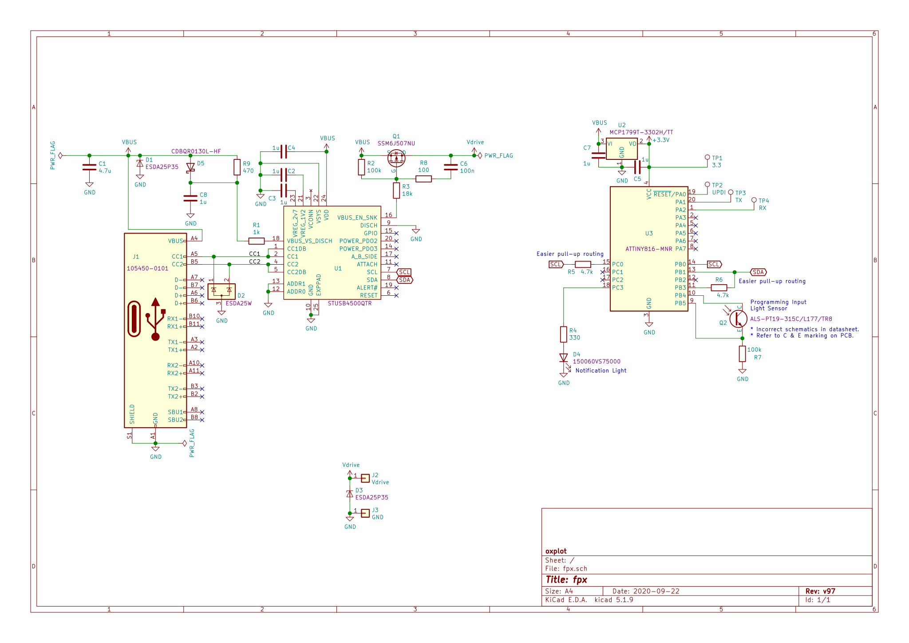
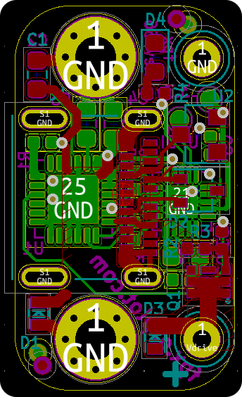
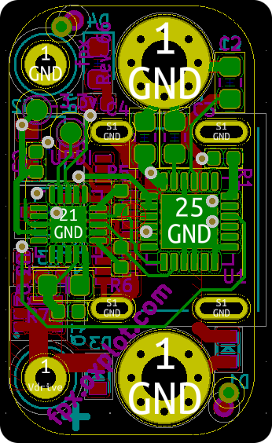

fpx board is designed using the amazing KiCad. The design files here are
ready for manufacturing and they include part numbers as well.

 

 fpx is certified open source hardware

## QA

1. Program the board with Atmel Studio. Ensure erase, flash and verify
   all show "OK".
2. Configure the board with [fpx web
   configurer](https://fpx.oxplot.com/#configure). Ensure the green
   light flashes.
3. Measure the output terminals. It should be 5 volts.
