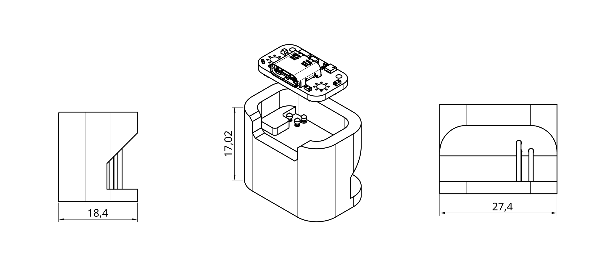
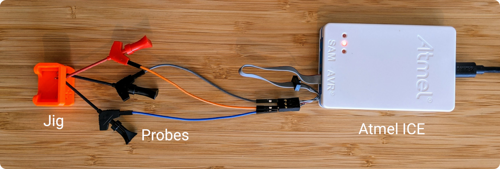

fpx runs on ATtiny 816 which is programmed over a single wire UPDI
interface. It can be programmed and live debugged using Atmel ICE.

fpx exposes UPDI, along with output of the 3.3v linear regulator as test
points. Together with the ground terminal, it's all that's needed to
program and debug the board using Atmel ICE.

## Programming Jig

A very rudimentary jig is provided in [STEP](./fpx_rev97_prog_jig.step)
and [STL](./fpx_rev97_prog_jig.stl) formats, suitable for pogo pins with
body diameter of 1 mm and compressed length of 14.5 mm. The source model
is [a public onshape document](https://cad.onshape.com/documents/b7cb965f97967d9fd459e84e/w/75a93212d414af572a197a4d/e/68acf7f0a0742a418e4545b1) which you can copy and make
modifications to. You will need a free onshape account to make changes.
The model can be 3D printed using extrusion printers such as Prusa i3,
without the need for overhang support.

The body of pogo pins are exposed on the side of the jig. You will need
clamp-type test probes or similar to make connections to the programmer
as shown below:

